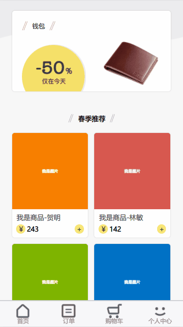

### 知乎日报

学习 udacity 的小程序的时候，看到需求分析图，感觉非常适合原来练习 vue,就自己做了一个。

###相关细节

-         `vue` `vuex` `vue-router`
-   使用`mock`进行生成随机数据，并拦截 ajax 请求
-   使用阿里的[Flexible](https://www.w3cplus.com/mobile/lib-flexible-for-html5-layout.html)插件就行移动端的适配
-   用`sass`函数计算`rem`，和提高写`css`的效率
-   布局大量使用更加优雅的[flex](https://yanhaijing.com/css/2016/08/21/flex-practice-on-mobile/)，并使用`postcss`的
    `autoprefixer`插件自动补齐兼容前缀
-   因为没有后台，所以目前所有的数据增删改都是，操作存储在`vuex`中的数据。



###收获

1.  对``vue`全家桶有了更深的使用和理解
2.  学会了使用 sass 和 postcss 等工具插件提高效率
3.  学会利用`keep-alive`进行动态组件的缓存，对`vue`的性能优化有了理解。
4.  体会到组件化、模块化开发带来的便捷
5.  熟悉了项目的开发流程

# 功能

-   [x] 商品展示页 -- 完成
-   [x] 商品详情页 -- 完成
-   [x] 商品评论页 -- 完成
-   [x] 购物车功能 -- 完成
-   [x] 登录页 -- 完成

# todo

-   [ ] 使用[json server](https://www.cnblogs.com/itfantasy/p/6043111.html)重构，进行实际应用中的的增删改数据
-   [ ] 根据价格进行排序和筛选
-   [ ] 发表评论
-   [ ] 首页轮播图
-   [ ] 完善的登录、注册
-   [ ] 使用[btter-scroll](https://www.imooc.com/article/18232)和[vue-lazyload](https://blog.csdn.net/SunnyYang222/article/details/78471870)优化使用体验

### Build Setup

```bash
# install dependencies
npm install

# serve with hot reload at localhost:8080
npm run dev
```
